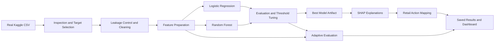

# 🛒 RetailIQ: Explainable Purchase Prediction

> A reproducible, end-to-end machine-learning project for predicting e-commerce purchases, explaining model decisions, and converting them into transparent retail-action suggestions.

RetailIQ uses the Kaggle **Indian E-Commerce Customer Behavior & Purchase** dataset to build an understandable purchase-prediction workflow. It inspects the real CSV, prevents target leakage, prepares a controlled feature set, compares class-balanced models, tunes their probability thresholds, produces global and local SHAP explanations, maps predictions to simple retail actions, and performs an offline adaptive-evaluation experiment.

All dataset findings, feature names, thresholds, metrics, predictions, explanations, and business summaries are calculated from the supplied CSV when the pipeline runs. Nothing is fabricated or hardcoded as an experimental result.

## ✨ What the project includes

- 🔍 **Automatic data inspection** — shape, columns, data types, missing values, duplicates, samples, target candidates, and leakage checks.
- 🧹 **Documented preprocessing** — missing-value treatment, duplicate removal, outlier reporting, categorical encoding, and model-specific scaling.
- 🧠 **Purchase prediction** — class-balanced Logistic Regression and Random Forest models.
- 🎯 **Threshold-aware evaluation** — precision–recall analysis and F1-maximizing probability thresholds instead of blindly relying on `0.5`.
- 📊 **Imbalance-aware metrics** — accuracy, precision, recall, F1-score, ROC–AUC, and confusion matrices.
- 🔎 **Explainable AI** — global SHAP importance, beeswarm analysis, and local explanations for real test examples.
- 💡 **Retail decision support** — inspectable rules that convert probabilities and SHAP drivers into cautious action suggestions.
- 🔄 **Adaptive experiment** — offline chronological evaluation with a transparent conditional-retraining trigger.
- 🖥️ **Read-only dashboard** — a Streamlit interface built entirely from already-saved results.
- 📓 **Faculty-ready notebooks** — six executed notebooks presenting the complete workflow in order.

## 🧭 Pipeline at a glance



## 📁 Project structure

```text
.
├── dashboard/
│   └── app.py                         # Read-only Streamlit dashboard
├── data/
│   └── Ecommerce.csv                  # Kaggle CSV placed here
├── models/
│   └── best_model.joblib              # Fitted pipeline and tuned threshold
├── notebooks/
│   ├── 01_data_understanding.ipynb
│   ├── 02_eda_preprocessing.ipynb
│   ├── 03_modeling_evaluation.ipynb
│   ├── 04_explainability_shap.ipynb
│   ├── 05_business_insights.ipynb
│   └── 06_adaptive_experiment.ipynb
├── results/
│   ├── figures/                       # EDA, evaluation, SHAP, and adaptive plots
│   ├── predictions/                   # Prediction examples with explanations
│   ├── tables/                        # Audits, metrics, insights, and comparisons
│   └── *_summary.txt                  # Human-readable phase summaries
├── src/
│   ├── data_prep.py                   # Inspection, target/leakage logic, preprocessing
│   ├── eda.py                         # EDA, class balance, outliers, and figures
│   ├── models.py                      # Model construction and training
│   ├── evaluate.py                    # Metrics, threshold tuning, and selection
│   ├── explain.py                     # Global and local SHAP explanations
│   ├── insights.py                    # Transparent retail-action rules
│   └── adaptive.py                    # Offline adaptive evaluation experiment
├── main.py                                # Complete pipeline orchestrator
├── requirements.txt
└── README.md
```

## 📦 Dataset setup

The project uses one fixed dataset:

**Indian E-Commerce Customer Behavior & Purchase**

[Download it from Kaggle](https://www.kaggle.com/datasets/kundanbedmutha/indian-e-commerce-customer-behavior-and-purchase)

1. Download the dataset archive from Kaggle.
2. Extract the archive.
3. Place the CSV inside the project's `data/` directory.

The current Kaggle file is named `Ecommerce.csv`, so the expected path is:

```text
data/Ecommerce.csv
```

The loader discovers the CSV programmatically. Keep only the intended dataset CSV in `data/` so that file discovery remains unambiguous. The software does not generate a substitute dataset when the real file is missing.

## 🚀 Quick start

### 1. Prerequisites

- Python **3.11** is recommended.
- Kaggle dataset downloaded and placed in `data/`.
- Run commands from the repository root.

### 2. Create and activate a virtual environment

Windows PowerShell:

```powershell
python -m venv .venv
.\.venv\Scripts\Activate.ps1
```

macOS or Linux:

```bash
python3 -m venv .venv
source .venv/bin/activate
```

### 3. Install dependencies

```bash
python -m pip install --upgrade pip
python -m pip install -r requirements.txt
```

### 4. Run the complete pipeline

```bash
python main.py
```

The command runs the complete workflow in this order:

1. Data inspection, target selection, and leakage detection.
2. Cleaning, preprocessing, class-balance analysis, and EDA.
3. Model training, evaluation, and threshold correction.
4. Global and local SHAP explanation generation.
5. Rule-based business-insight generation.
6. Offline adaptive evaluation and conditional retraining.
7. Final artifact validation.

At completion, the console prints the selected model, tuned threshold, generated artifact counts, and output locations. Depending on the machine, SHAP calculation and figure generation may take several minutes.

## 🧩 Run an individual phase

Every phase can also be executed independently from the project root:

```bash
python -m src.data_prep
python -m src.eda
python -m src.evaluate
python -m src.explain
python -m src.insights
python -m src.adaptive
```

Later phases depend on artifacts produced by earlier phases. For a fresh setup, `python main.py` is the recommended command.

## 🖥️ Launch the dashboard

Run the pipeline at least once so that `results/` is populated, and then start Streamlit:

```bash
streamlit run dashboard/app.py
```

The dashboard contains six tabs:

1. **Dataset Overview**
2. **Customer Analytics / EDA**
3. **Purchase Prediction Results**
4. **SHAP Explanation Viewer**
5. **Business Insights**
6. **Adaptive Before/After Comparison**

The dashboard is intentionally read-only. It reads the saved summaries, tables, predictions, and figures; it does not retrain models, call external services, or modify pipeline outputs.

## 📊 Understanding the generated results

### Summary reports

| File | What it contains |
|---|---|
| `results/dataset_summary.txt` | Shape, columns, data types, missing values, duplicates, sample records, selected target, and leakage exclusions. |
| `results/eda_preprocessing_summary.txt` | Missing-value strategy, encoding decisions, duplicate handling, outlier findings, and class balance. |
| `results/modeling_evaluation_summary.txt` | Train/test design, model metrics, model comparison, and threshold correction. |
| `results/shap_explainability_summary.txt` | Explainer selection and global/local SHAP results. |
| `results/business_insights_summary.txt` | Retail-action counts, rule descriptions, and the precision caveat. |
| `results/adaptive_experiment_summary.txt` | Batch construction, retraining trigger decision, and observed before/after metrics. |

### Output folders

- **`results/figures/`** contains the target distribution, correlation heatmap, behavior-versus-target charts, default and tuned confusion matrices, global and local SHAP plots, and the adaptive comparison chart.
- **`results/tables/`** contains missing-value and encoding audits, the outlier report, model comparison, threshold tuning, SHAP examples, business insights, and adaptive before/after metrics.
- **`results/predictions/`** contains real high-probability, low-probability, and threshold-borderline examples with actual labels and SHAP contributions.
- **`models/best_model.joblib`** stores the fitted preprocessing/model pipeline and its tuned decision threshold.

Generated metrics should always be read from the current result files because they are recalculated whenever the pipeline runs on the supplied dataset.

## 📓 Recommended notebook walkthrough

For a faculty demonstration, open the executed notebooks in this order:

| No. | Notebook | Coverage |
|---:|---|---|
| 01 | `01_data_understanding.ipynb` | Loading, inspection, target selection, and leakage checks. |
| 02 | `02_eda_preprocessing.ipynb` | Cleaning, encoding, outlier analysis, class balance, and EDA. |
| 03 | `03_modeling_evaluation.ipynb` | Encoding correction, model training, evaluation, and threshold tuning. |
| 04 | `04_explainability_shap.ipynb` | Global and local SHAP explanations. |
| 05 | `05_business_insights.ipynb` | Transparent action rules and the precision caveat. |
| 06 | `06_adaptive_experiment.ipynb` | Chronological batch evaluation and conditional retraining. |

Each notebook imports the corresponding `src/` implementation and displays real executed output directly below its code cells. The notebooks are a presentation layer; the reusable logic remains in the Python modules.

## ⏳ Adaptive experiment: what is real and what is simulated?

The current dataset contains the Phase 1-confirmed `visit_date` field. Consequently, the saved Phase 6 experiment uses a **real chronological split**:

- earlier visit dates train the initial model;
- later visit dates act as the incoming offline batch;
- an explicit F1-based rule determines whether retraining is triggered.

For the supplied dataset, the recorded batch division is therefore **not a random simulation**. However, it remains an offline classroom experiment using a fixed historical CSV. It is not a live monitoring service and does not claim to detect production drift in real time.

`src/adaptive.py` includes a fallback for a future dataset copy with no usable date/time field. That fallback uses a fixed random batch split labelled `random_batch_STAND_IN_simulation`. Such a run is explicitly a simulation and must not be presented as genuine temporal drift.

## 🧪 Reproducibility and design choices

- Fixed random seeds are used throughout model splitting and training.
- The target and leakage exclusions come from programmatic inspection of the real data.
- High-cardinality categorical features are audited to prevent uncontrolled one-hot expansion.
- Scaling is applied where required by Logistic Regression; tree models receive an appropriate unscaled representation.
- Class weighting and stratification address the observed target imbalance.
- F1-score and ROC–AUC are prioritized over accuracy for model comparison.
- Probability thresholds are selected from held-out precision–recall behaviour.
- Outliers are reported rather than silently deleted.
- Retail actions use transparent rules rather than another hidden model.
- No external or paid API, cloud infrastructure, database, real-time stream, deep-learning model, or generative-AI component is used.

## 🛠️ Troubleshooting

### Dataset not found

Confirm that the extracted CSV is inside `data/` and that no unrelated CSV files are present there.

```text
data/Ecommerce.csv
```

### Module import error

Run commands from the repository root, not from inside `src/` or `notebooks/`.

### Streamlit opens without results

Generate the saved artifacts first:

```bash
python main.py
streamlit run dashboard/app.py
```

### Notebook imports fail

Start Jupyter from the project root so the notebooks can import the shared `src/` modules.

## 🧰 Technology stack

- Python
- pandas and NumPy
- scikit-learn
- SHAP
- Matplotlib and Seaborn
- Streamlit

Exact reproducible package versions are listed in [`requirements.txt`](requirements.txt).

## 📌 Project scope

RetailIQ is a small, reproducible undergraduate software project. It demonstrates a complete offline machine-learning workflow and does not represent a production recommendation engine, real-time drift-monitoring platform, or guaranteed purchasing system. Promotion-related outputs are intentionally described as **candidate actions** because prediction errors and false positives remain possible.
